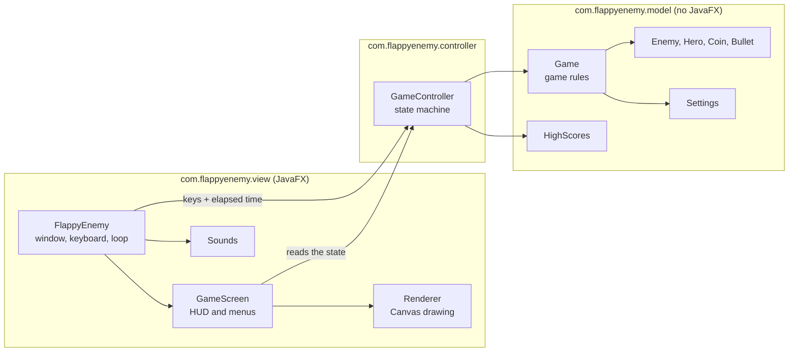

# Flappy Enemy

[Français](README.md) · [English](README.en.md)

A small game in Java 21 and JavaFX where you play the ghost: you fly between heroes charging at you,
collect coins, and shoot the heroes down before they touch you.


The project started as a simple first version built with MVC. I then reworked it in depth: the game logic no
longer depends on JavaFX, it is tested, and the game can be run, tested and packaged without any hassle.
Names (classes, methods, variables) and in-game text are in English; the code comments are in French.

## Playing

Space to fly, E to shoot, P (or Esc) to pause, Enter to start or restart a game, M to mute the sound.

The scenery scrolls faster and faster and heroes show up more and more often. There are three kinds:

| Hero | What it does | If you touch it | If you shoot it |
|---|---|---|---|
| Warrior (`MeleeHero`) | Charges in a straight line | You're dead | +5 points |
| Ninja (`StealthHero`) | Falls from the sky in a zigzag | -10 points | +8 points |
| Knight (`TankHero`) | Advances while teleporting in short jumps | -50 health | +7 points |

Each coin is worth 1 point, but it makes the ghost a bit heavier: gravity increases, up to a cap.
Your five best scores are kept in `~/.flappy-enemy/scores.txt`.

<p>
  
  
</p>

## Running it

You need JDK 21 or later, and Maven:

```bash
mvn javafx:run
```

To get an app that bundles its own JVM (so there is nothing to install to run it):

```bash
./scripts/package.sh
```

The result is in `target/dist`. The [release.yml](.github/workflows/release.yml) workflow runs this script on
macOS, Linux and Windows when a `v*` tag is pushed, and attaches the archives to the GitHub release. It runs
without errors on all three systems, but I have only launched the app on macOS.

These apps are not signed (signing requires a paid developer account), so your system may show a warning the
first time you open them. It is not a bug:

- **macOS**: "FlappyEnemy cannot be opened because the developer cannot be verified". Right-click
  `FlappyEnemy.app`, choose Open, then confirm. Or, in a terminal:
  `xattr -dr com.apple.quarantine FlappyEnemy.app`. The macOS build targets Apple Silicon (M1 and later).
- **Windows**: on the SmartScreen screen, click "More info", then "Run anyway".
- **Linux**: nothing special.

## How it is built

The guiding idea: the model (`com.flappyenemy.model`) knows nothing about JavaFX. All the rules live in the
`Game` class, which moves forward with `update(dt)`, a time step in seconds. Without a window, it can run inside
a test, as fast and as long as you want.



A few choices worth explaining:

- Each hero knows how it moves, what it does on contact and how many points it gives when shot. The engine
  never has to check a hero's type. Adding one takes a class and one line in the `HeroType` enum, which also
  creates them.
- `GameController` handles the states (menu, game, pause, game over), caps the time step and records the scores.
- `Game` plays no sound. It notes what happens (jump, coin collected, damage...) and the view turns that into
  sounds.
- The settings (speeds, gravity, how often heroes appear) are in
  [game.properties](src/main/resources/game.properties). If a value is missing or makes no sense, the game falls
  back to the default.

## Tests

```bash
mvn verify
```

There are 86 JUnit 5 tests. They cover about 97% of the model's lines and 92% of the controller's (measured by
JaCoCo, report in `target/site/jacoco`). The JavaFX view is not tested, apart from one test that checks that
its images, sounds and stylesheets are all there.

Several tests guard against bugs from the first version: bullets that kept flying, invisible, after hitting a
hero; elements skipped when removing from a list while looping over it; missed collisions between two squares
crossing each other. To make sure these tests are worth something, I put those bugs back into a copy of the
code and checked that the tests failed.

Continuous integration ([ci.yml](.github/workflows/ci.yml)) runs the tests on every push.

## Images, sounds and icons

Everything is generated by code: Java2D for the drawings and icons, a small synthesizer for the sounds. Nothing
is borrowed from elsewhere. The script is in [tools/GenerateAssets.java](tools/GenerateAssets.java):

```bash
java -Djava.awt.headless=true tools/GenerateAssets.java
```

## Where to find what

```
src/main/java/com/flappyenemy/model        The game rules, no JavaFX
src/main/java/com/flappyenemy/controller   The game states, the scores
src/main/java/com/flappyenemy/view         The window, drawing, sounds (JavaFX)
src/main/resources                         Images, sounds, style.css, game.properties
src/test/java                              The JUnit 5 tests
packaging/                                 The app icons (macOS, Windows, Linux)
tools/                                     The image, sound and icon generator
scripts/package.sh                         Building the standalone app
.github/workflows                          Continuous integration and releases
docs/                                      The screenshots and GIF used in this README
```

## What next?

If I kept going: an online leaderboard, levels, and new heroes (the `HeroType` enum is made for that).
