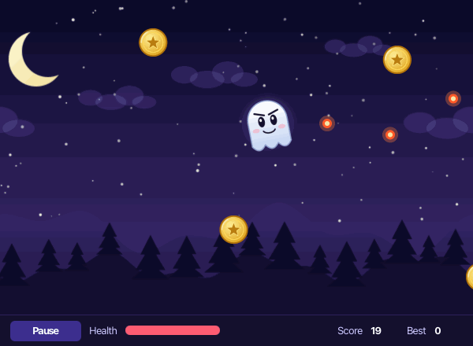
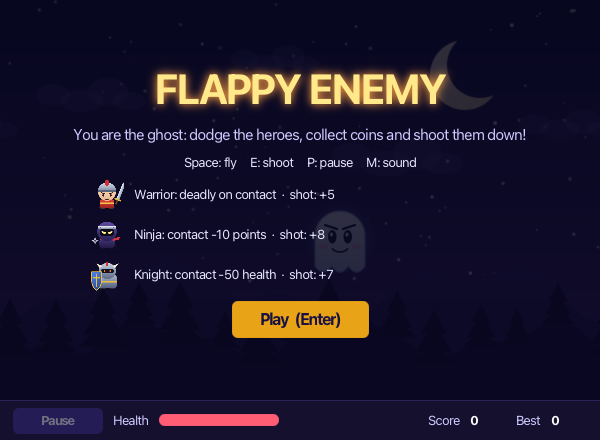
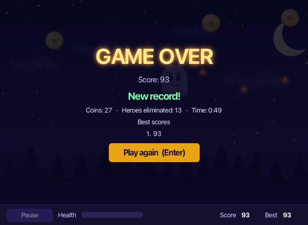
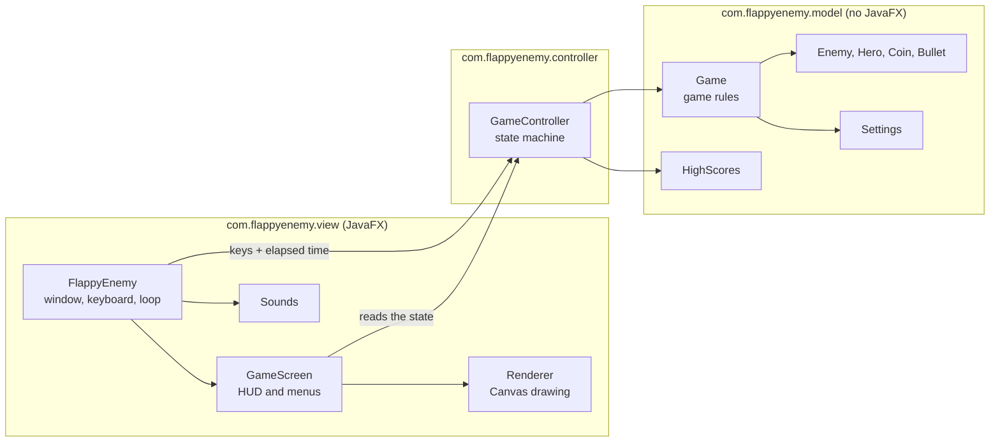

# Flappy Enemy

[Français](README.md) · [English](README.en.md)

Un petit jeu en Java 21 et JavaFX où vous jouez le fantôme : vous volez entre des héros qui foncent sur vous,
vous ramassez des pièces et vous les abattez avant qu'ils ne vous touchent.



Le projet est parti d'une première version simple, construite en MVC. Je l'ai ensuite reprise en profondeur :
la logique du jeu ne dépend plus de JavaFX, elle est testée, et le jeu se lance, se teste et se package sans
rien de compliqué. Les noms (classes, méthodes, variables) et les textes du jeu sont en anglais ; les
commentaires du code sont en français.

## Jouer

Espace pour voler, E pour tirer, P (ou Échap) pour la pause, Entrée pour lancer ou relancer une partie,
M pour couper le son.

Le décor défile de plus en plus vite et les héros arrivent de plus en plus souvent. Il y en a trois sortes :

| Héros | Ce qu'il fait | Si vous le touchez | Si vous le tirez |
|---|---|---|---|
| Warrior (`MeleeHero`) | Fonce en ligne droite | Vous êtes mort | +5 points |
| Ninja (`StealthHero`) | Tombe du ciel en zigzaguant | -10 points | +8 points |
| Knight (`TankHero`) | Avance en se téléportant par à-coups | -50 de vie | +7 points |

Chaque pièce vaut 1 point, mais rend le fantôme un peu plus lourd : la gravité augmente, jusqu'à un plafond.
Vos cinq meilleurs scores sont gardés dans `~/.flappy-enemy/scores.txt`.

<p>
  
  
</p>

## Le lancer

Il faut un JDK 21 ou plus, et Maven :

```bash
mvn javafx:run
```

Pour obtenir une application qui embarque sa propre JVM (donc rien à installer pour la lancer) :

```bash
./scripts/package.sh
```

Le résultat se trouve dans `target/dist`. Le workflow [release.yml](.github/workflows/release.yml) lance ce
script sur macOS, Linux et Windows quand on pousse un tag `v*`, et joint les archives à la release GitHub. Il
tourne sans erreur sur les trois systèmes, mais je n'ai lancé l'application que sur macOS.

Ces applications ne sont pas signées (la signature demande un compte développeur payant), donc votre système
peut afficher un avertissement au premier lancement. Ce n'est pas un bug :

- **macOS** : « FlappyEnemy ne peut pas être ouvert car son développeur ne peut pas être vérifié ». Faites un
  clic droit sur `FlappyEnemy.app`, choisissez Ouvrir, puis confirmez. Ou, dans un terminal :
  `xattr -dr com.apple.quarantine FlappyEnemy.app`. La version macOS est construite pour Apple Silicon
  (M1 et plus récent).
- **Windows** : sur l'écran SmartScreen, cliquez sur « Informations complémentaires », puis « Exécuter quand même ».
- **Linux** : rien de particulier.

## Comment c'est construit

L'idée directrice : le modèle (`com.flappyenemy.model`) ne connaît pas JavaFX. Toutes les règles vivent dans la
classe `Game`, qu'on fait avancer avec `update(dt)`, un pas de temps en secondes. Sans fenêtre, on peut donc la
faire tourner dans un test, aussi vite et aussi longtemps qu'on veut.



Quelques choix qui méritent d'être expliqués :

- Chaque héros sait comment il bouge, ce qu'il fait au contact et combien il rapporte quand on le tire. Le
  moteur n'a donc jamais à tester le type d'un héros. Pour en ajouter un, il suffit d'une classe et d'une ligne
  dans l'énumération `HeroType`, qui sert aussi à les fabriquer.
- `GameController` gère les états (menu, partie, pause, game over), limite le pas de temps et enregistre les scores.
- `Game` ne joue aucun son. Elle note ce qui se passe (saut, pièce ramassée, dégâts...) et c'est la vue qui en
  tire les sons.
- Les réglages (vitesses, gravité, fréquence des héros) sont dans
  [game.properties](src/main/resources/game.properties). Si une valeur manque ou n'a pas de sens, le jeu
  retombe sur celle par défaut.

## Les tests

```bash
mvn verify
```

Il y a 86 tests JUnit 5. Ils couvrent environ 97 % des lignes du modèle et 92 % du contrôleur (mesuré par
JaCoCo, rapport dans `target/site/jacoco`). La vue JavaFX n'est pas testée, à part un test qui vérifie que ses
images, ses sons et ses feuilles de style sont bien présents.

Plusieurs tests protègent des bugs de la première version : des balles qui continuaient à voler, invisibles,
après avoir touché un héros ; des éléments sautés quand on supprime dans une liste qu'on est en train de
parcourir ; des collisions manquées entre deux carrés qui se croisent. Pour m'assurer que ces tests servent à
quelque chose, j'ai remis ces bugs dans une copie du code et vérifié qu'ils échouaient.

L'intégration continue ([ci.yml](.github/workflows/ci.yml)) lance les tests à chaque push.

## Images, sons et icônes

Tout est généré par du code : Java2D pour les dessins et les icônes, une petite synthèse pour les sons. Aucun
fichier n'est emprunté ailleurs. Le script se trouve dans
[tools/GenerateAssets.java](tools/GenerateAssets.java) :

```bash
java -Djava.awt.headless=true tools/GenerateAssets.java
```

## Où trouver quoi

```
src/main/java/com/flappyenemy/model        Les règles du jeu, sans JavaFX
src/main/java/com/flappyenemy/controller   Les états du jeu, les scores
src/main/java/com/flappyenemy/view         La fenêtre, le dessin, les sons (JavaFX)
src/main/resources                         Images, sons, style.css, game.properties
src/test/java                              Les tests JUnit 5
packaging/                                 Les icônes de l'application (macOS, Windows, Linux)
tools/                                     Le générateur d'images, de sons et d'icônes
scripts/package.sh                         La construction de l'application autonome
.github/workflows                          L'intégration continue et les releases
docs/                                      Les captures et le GIF de ce README
```

## Et ensuite ?

Si je continuais : un classement en ligne, des niveaux, et de nouveaux héros (l'énumération `HeroType` est
faite pour ça).
